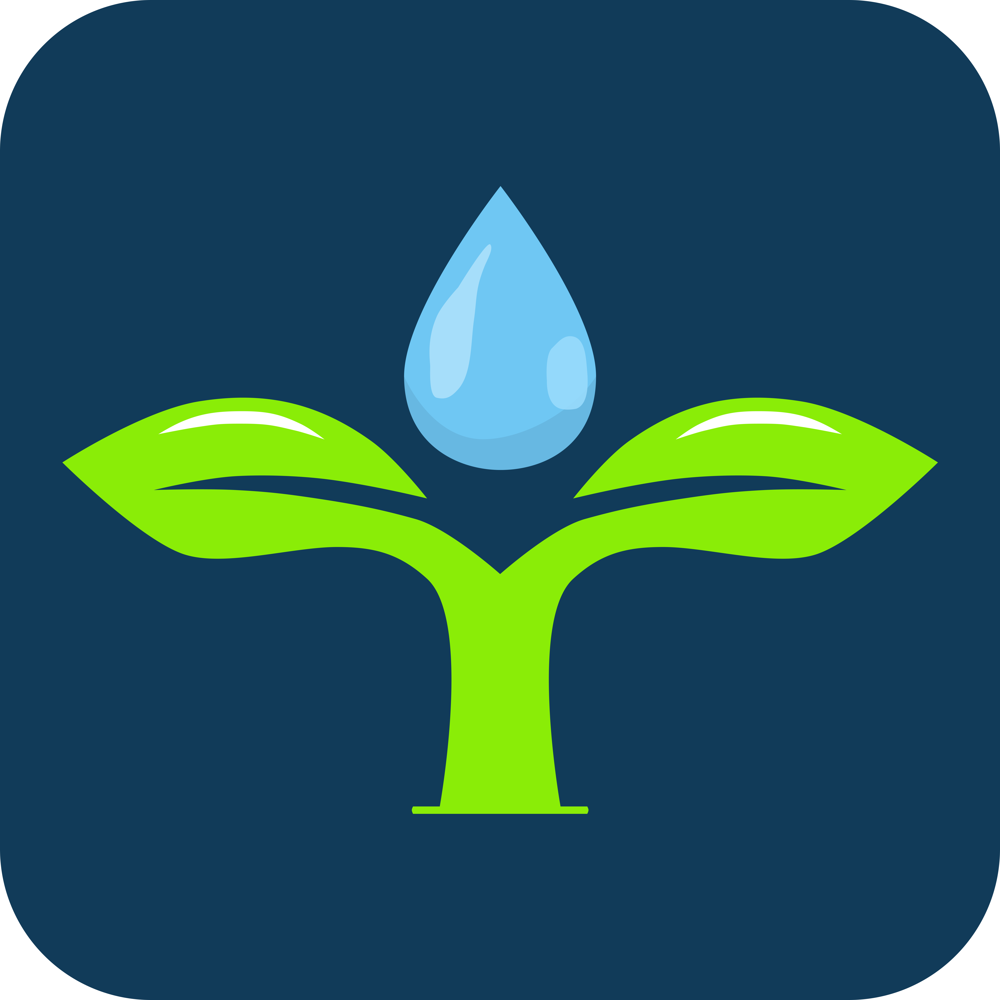

  <h1>C23-PC369-Tani Tama Indonesia<h1>

Welcome to the official GitHub repository of Team C23-PC369 from Bangkit program. We are a group of dedicated individuals from various backgrounds who came together to collaborate on different aspects of technology. Our team is comprised of talented individuals specializing in Machine Learning, Cloud Computing, and Mobile Development. Together, we aim to make a positive impact on the world of technology and contribute to the growth of the Indonesian tech industry.

  
Click here to view more about our team

## Team Members

### Machine Learning Team

| Bangkit ID  | Nama                           | Sosial Media                                                                                                                                                                                                                                                                                      |
| ----------- | ------------------------------ | ------------------------------------------------------------------------------------------------------------------------------------------------------------------------------------------------------------------------------------------------------------------------------------------------- |
| M366DSX2156 | Ahmad Rosyihuddin              |    |
| M151DSX1562 | Matyus Garbela Ismanto         |    |
| M287DSX0510 | Rizky Pratama Syahrul Ramadhan |    |

### Cloud Computing Team

| Bangkit ID  | Nama                | Sosial Media                                                                                                                                                                                                                                                                                      |
| ----------- | ------------------- | ------------------------------------------------------------------------------------------------------------------------------------------------------------------------------------------------------------------------------------------------------------------------------------------------- |
| C114DSX3336 | Grevalby            |    |
| C356DSX0941 | Micko Agung Pratama |    |

### Mobile Development Team

| Bangkit ID  | Nama          | Sosial Media                                                                                                                                                                                                                                                                                      |
| ----------- | ------------- | ------------------------------------------------------------------------------------------------------------------------------------------------------------------------------------------------------------------------------------------------------------------------------------------------- |
| A037DSY1086 | Iriel Aureleo |    |

## Project: Tani Tama

**Description**: Tani Tama is an advanced agricultural application that utilizes Machine Learning to detect plant diseases. With the help of computer vision algorithms, Tani Tama can analyze images of plants and accurately identify diseases or abnormalities. This empowers farmers to take timely actions, prevent the spread of diseases, and maximize crop yields.

## About the Project

In the Bangkit program, our team, C23-PC369, came together with the common goal of exploring and expanding our knowledge in the fields of Machine Learning, Cloud Computing, and Mobile Development. We have collaborated on various projects and assignments, allowing us to gain practical experience and enhance our skills.

Throughout our journey, we have delved into the realm of Machine Learning, employing cutting-edge algorithms and techniques to solve real-world problems. We have dived into Cloud Computing, harnessing the power of cloud platforms to develop scalable and efficient solutions. Furthermore, we have explored the world of Mobile Development, crafting user-friendly and intuitive mobile applications.

Our passion for technology and our commitment to continuous learning have been the driving forces behind our collaboration and success. By combining our unique skills and diverse perspectives, we strive to create innovative solutions that make a difference.

## Contact Us

If you have any inquiries, suggestions, or would simply like to connect with us, please feel free to reach out to our team members individually. We are excited to engage in discussions and collaborate with fellow enthusiasts and professionals.

## Team C23-PC369

Thank you for visiting our GitHub repository and for your interest in our team's projects. We appreciate your support and look forward to sharing our journey with you.

  <b>C23-PC369 Teams</b>

